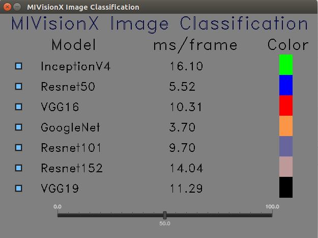

[](https://opensource.org/licenses/MIT)
[](https://travis-ci.org/kiritigowda/MIVisionX-Classifier)

# Live Image Classification

This application runs know CNN image classifiers on live/pre-recorded video stream.

## MIVisionX Image Classification Control
<p align="center"></p>

## MIVisionX Image Classification
<p align="center"></p>

## Usage

### Prerequisites
Build & Install [MIVisionX](https://github.com/GPUOpen-ProfessionalCompute-Libraries/MIVisionX#build--install-mivisionx)

### Build
````
git clone https://github.com/kiritigowda/MIVisionX-Classifier
cd MIVisionX-Classifier
cmake .
make
````

### Run
```
Usage: ./classifier 
        --inception <inceptionV4 weights.bin> [optional]
        --resnet50 <resnet50 weights.bin>     [optional]
        --vgg16 <vgg16 weights.bin>           [optional]
        --googlenet <googlenet weights.bin>   [optional]
        --resnet101 <resnet101 weights.bin>   [optional]
        --resnet152 <resnet152 weights.bin>   [optional]
        --vgg19 <vgg19 weights.bin>           [optional]
        --label <label text>                  [required]
        --video <video file>/<--capture 0>    [required]
```

#### Generating weights.bin for different Models
Download or train your own caffemodel and run the [model_compiler](https://github.com/GPUOpen-ProfessionalCompute-Libraries/MIVisionX/tree/master/model_compiler#neural-net-model-compiler--optimizer) to get the corresponding weights.bin file.

1. Download or train your own caffemodel.

Here is the sample download link that contains all the prototxt: 

https://github.com/SnailTyan/caffe-model-zoo

2. Using [Model Compiler](https://github.com/GPUOpen-ProfessionalCompute-Libraries/MIVisionX/tree/master/model_compiler#neural-net-model-compiler--optimizer)

To convert a caffemodel into AMD NNIR model:
```
% python caffe_to_nnir.py <net.caffeModel> <nnirOutputFolder> --input-dims <n,c,h,w> [--verbose <0|1>]
```

To convert an AMD NNIR model into OpenVX C code:
````
% python nnir_to_openvx.py <nnirModelFolder> <nnirModelOutputFolder>
````

The weights file will be generated and you can use that as an input for this project.

#### --label text

The labels.txt file in this project.
  
#### --video file
Test the classification on your own video. Give the path to your video.
  
#### --capture 0
If you want to test with a live cam, turn on this option.

### Example
```
./classifier --inception /PATH/TO/inceptionV4/weights.bin --resnet50/PATH/TO/resnet50/weights.bin ...
...
--vgg19 /PATH/TO/vgg19/weights.bin 
--label labels.txt
--capture 0
```
